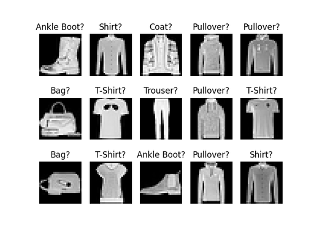

<!-- Apply header and footer to first slide only -->
<!-- _header: "[](https://ensc.bordeaux-inp.fr)" -->
<!-- _footer: "[Baptiste Pesquet](https://www.bpesquet.fr)" -->
<!-- headingDivider: 3 -->

# Convolutional Neural Network with PyTorch

<!-- Show pagination, starting with second slide -->
<!-- paginate: true -->

## Scope and objective

This example trains a convolutional neural network to classify fashion items. The complete sourse code is available [here](test_convolutional_neural_network.py).



## Imports

```python
import math
import matplotlib.pyplot as plt
import torch
from torch import nn
from torch.utils.data import DataLoader
from torchvision import datasets, transforms
```

## GPU support

> The `get_device()` utility function was defined in a [previous example](../fundamentals/README.md#gpu-support)

```python
device = get_device()
print(f"PyTorch {torch.__version__}, using {device} device")
```

## Hyperparameters

```python
# Hyperparameters
n_epochs = 10  # Number of training iterations on the whole dataset
learning_rate = 0.001  # Rate of parameter change during gradient descent
batch_size = 64  # Number of samples used for one gradient descent step
conv2d_kernel_size = 3  # Size of the 2D convolution kernels
```

## Dataset loading

We use [Fashion-MNIST](https://github.com/zalandoresearch/fashion-mnist), a classic dataset for image recognition. Each example is a 28x28 grayscale image,  associated with a label (fashion category) from 10 possible classes: t-shirt, trouser, pullover...

This dataset is provided by PyTorch through the [FashionMNIST](https://pytorch.org/vision/0.19/generated/torchvision.datasets.FashionMNIST.html) class. In order to evaluate the trained model performance on unseen data, this class lets us download either the training set (60,000 images) or the test set (10,000 images).

Alongside download, a [transform](https://pytorch.org/vision/main/transforms.html) operation is applied to turn images into PyTorch tensors of shape `(color_depth, height, width)`, with pixel values scaled to the $[0,1]$ range.

### Dataset download

```python
# Directory for downloaded files
DATA_DIR = "./_output"

# Download and construct the Fashion-MNIST images dataset
# The training set is used to train the model
train_dataset = datasets.FashionMNIST(
    root=DATA_DIR,
    train=True,  # Training set
    download=True,
    transform=transforms.ToTensor(),
)
# The test set is used to evaluate the trained model performance on unseen data
test_dataset = datasets.FashionMNIST(
    root=DATA_DIR,
    train=False,  # Test set
    download=True,
    transform=transforms.ToTensor(),
)
```

### Bacth loading: training set

```python
# Create data loader for loading training data as randomized batches
train_dataloader = DataLoader(
    dataset=train_dataset, batch_size=batch_size, shuffle=True
)
# Number of training samples
n_train_samples = len(train_dataloader.dataset)
# Number of batches in an epoch (= n_train_samples / batch_size, rounded up)
n_batches = len(train_dataloader)
assert n_batches == math.ceil(n_train_samples / batch_size)
```

### Bacth loading: test set

```python
# Create data loader for loading test data as randomized batches
test_dataloader = DataLoader(
    dataset=test_dataset, batch_size=batch_size, shuffle=False
)
# Number of test samples
n_test_samples = len(test_dataloader.dataset)

print(f"{n_train_samples} training samples, {n_test_samples} test samples")
```

## Model definition

### PyTorch models as classes

Most non-trivial PyTorch models are created as subclasses of the [Module](https://pytorch.org/docs/stable/generated/torch.nn.Module.html) class. Two elements must be included into a model class:

- the constructor (`__init__()` function) to define the model architecture;
- the `forward()` function to implement the forward pass of input data through the model.

This is all PyTorch needs to compute gradients thanks to its [autodifferentiation engine](../fundamentals/README.md#autodifferentiation).

### Model architecture

We design a basic convolutional network. It takes a tensor of shape `(1, 28, 28)` (a rescaled grayscale image) as input and applies 2D convolution and max-pooling operations to detect interesting features. The output of these operations is flattened into a vector and passes through two linear layers (also called *dense* of *fully connected* layers) to compute 10 values, one for each possible class.


### Model implementation

Our model implementation leverages the following PyTorch classes:

- [Sequential](https://pytorch.org/docs/stable/generated/torch.nn.Sequential.html) to create a sequential container of operations.
- [Conv2d](https://pytorch.org/docs/stable/generated/torch.nn.Conv2d.html) to apply a 2D convolution operation.
- The [ReLU](https://pytorch.org/docs/stable/generated/torch.nn.ReLU.html) activation function.
- [MaxPool2d](https://pytorch.org/docs/stable/generated/torch.nn.MaxPool2d.html) to apply max-pooling.
- [Flatten](https://pytorch.org/docs/stable/generated/torch.nn.Flatten.html) to flatten the extracted features into a vector.
- [LazyLinear](https://pytorch.org/docs/stable/generated/torch.nn.LazyLinear.html), a fully connected layer whose input features are inferred during the first forward pass.
- [Linear](https://pytorch.org/docs/stable/generated/torch.nn.Linear.html), a fully connected layer used for final classification.

---

```python
class Convnet(nn.Module):
    """Convnet for fashion articles classification"""

    def __init__(self, conv2d_kernel_size=3):
        super().__init__()

        # Define a sequential stack of layers
        self.layer_stack = nn.Sequential(
            # 2D convolution, output shape: (batch_zize, out_channels, output_dim, output_dim)
            # Without padding, output_dim = (input_dim - kernel_size + 1) / stride
            nn.Conv2d(in_channels=1, out_channels=32, kernel_size=conv2d_kernel_size),
            nn.ReLU(),
            # Max pooling, output shape: (batch_zize, out_channels, input_dim // kernel_size, input_dim // kernel_size)
            nn.MaxPool2d(kernel_size=2),
            nn.Conv2d(in_channels=32, out_channels=64, kernel_size=conv2d_kernel_size),
            nn.ReLU(),
            nn.MaxPool2d(kernel_size=2),
            # Flattening layer, output shape: (batch_zize, out_channels * output_dim * output_dim)
            nn.Flatten(),
            # Linear layer whose input features are inferred during the first call to forward(). Output shape: (batch_zize, 128).
            # This avoids hardcoding the output shape of the previous layer, which depends on the shape of input images
            nn.LazyLinear(out_features=128),
            nn.ReLU(),
            # Output shape: (batch_size, 10)
            nn.Linear(in_features=128, out_features=10),
        )

    def forward(self, x):
        """Define the forward pass of the model"""

        # Compute output of layer stack
        logits = self.layer_stack(x)

        # Logits are a vector of raw (non-normalized) predictions
        # This vector contains 10 values, one for each possible class
        return logits
```

### Model instantiation

```python
# Create the convolutional network
model = Convnet(conv2d_kernel_size=conv2d_kernel_size).to(device)

# Use the first training image as dummy to initialize the LazyLinear layer.
# This is mandatory to count model parameters (see below)
first_img, _ = train_dataset[0]
# Add a dimension (to match expected shape with batch size) and store tensor on device memory
dummy_batch = first_img[None, :].to(device)
model(dummy_batch)

# Print model architecture
print(model)
```

### Parameter count

```python
# Compute and print parameter count
n_params = get_parameter_count(model)
print(f"Model has {n_params} trainable parameters")

# Conv2d layers have (in_channels * kernel_size * kernel_size + 1) * out_channels parameters
n_params_cond2d1 = (1 * conv2d_kernel_size * conv2d_kernel_size + 1) * 32
n_params_cond2d2 = (32 * conv2d_kernel_size * conv2d_kernel_size + 1) * 64

# Max-pooling layers have zero parameters

# Linear layers have (in_features + 1) * out_features parameters.
# To compute in_features for the first linear layer, we have to infer the output shapes of the previous layers.
conv2d1_output_dim = 28 - conv2d_kernel_size + 1  # 2D cnvolution with no padding
maxpool1_output_dim = conv2d1_output_dim // 2  # Max-pooling with a kernel of size 2
conv2d2_output_dim = (
    maxpool1_output_dim - conv2d_kernel_size + 1
)  # 2D cnvolution with no padding
maxpool2_output_dim = conv2d2_output_dim // 2  # 2D cnvolution with no padding
# Output shape for the second max-pooling layer: (batch_size, 64, maxpool2_output_dim, maxpool2_output_dim)
# Output shape for the flattening layer: (batch_size, 64 * maxpool2_output_dim * maxpool2_output_dim)
n_params_linear1 = (64 * maxpool2_output_dim * maxpool2_output_dim + 1) * 128

n_params_linear2 = (128 + 1) * 10

assert (
    n_params
    == n_params_cond2d1 + n_params_cond2d2 + n_params_linear1 + n_params_linear2
)
```

## Loss function

For this multiclass classification task, we use the [CrossEntropyLoss](https://pytorch.org/docs/stable/generated/torch.nn.CrossEntropyLoss.html) class.

> As seen in a [previous example](../logistic_regression/README.md#loss-function), this class uses a softmax operation to output a probability distribution before computing the loss value.

```python
# Use cross-entropy loss function.
# nn.CrossEntropyLoss computes softmax internally
criterion = nn.CrossEntropyLoss()
```

## Gradient descent optimizer

We use the standard [Adam](https://pytorch.org/docs/stable/generated/torch.optim.Adam.html) optimizer, which improves the gradient descent algorithm through various optimizations ([more details](https://github.com/bpesquet/mlcourse/tree/main/lectures/gradient_descent#gradient-descent-optimization-algorithms)).

```python
# Adam optimizer for gradient descent
optimizer = torch.optim.Adam(model.parameters(), lr=learning_rate)
```

## Training loop

```python
# Set the model to training mode - important for batch normalization and dropout layers.
# Unnecessary here but added for best practices
model.train()

# Train the model
for epoch in range(n_epochs):
    # Total loss for epoch, divided by number of batches to obtain mean loss
    epoch_loss = 0

    # Number of correct predictions in an epoch, used to compute epoch accuracy
    n_correct = 0

    for x_batch, y_batch in train_dataloader:
        # Copy batch data to GPU memory (if available)
        x_batch, y_batch = x_batch.to(device), y_batch.to(device)

        # Forward pass
        y_pred = model(x_batch)

        # Compute loss value
        loss = criterion(y_pred, y_batch)

        # Gradient descent step
        optimizer.zero_grad()
        loss.backward()
        optimizer.step()

        with torch.no_grad():
            # Accumulate data for epoch metrics: loss and number of correct predictions
            epoch_loss += loss.item()
            n_correct += (
                (model(x_batch).argmax(dim=1) == y_batch).float().sum().item()
            )

    # Compute epoch metrics
    mean_loss = epoch_loss / n_batches
    epoch_acc = n_correct / n_train_samples

    print(
        f"Epoch [{(epoch + 1):3}/{n_epochs:3}] finished. Mean loss: {mean_loss:.5f}. Accuracy: {epoch_acc * 100:.2f}%"
    )
```

## Model evaluation on test data

Since we have a test set, we are able to assess the trained model performance on unseen data. This is important to detect the presence of overfitting.

```python
# Set the model to evaluation mode - important for batch normalization and dropout layers.
# Unnecessary here but added for best practices
model.eval()

# Compute model accuracy on test data
with torch.no_grad():
    n_correct = 0

    for x_batch, y_batch in test_dataloader:
        # Copy batch data to GPU memory (if available)
        x_batch, y_batch = x_batch.to(device), y_batch.to(device)

        y_pred = model(x_batch)
        n_correct += (model(x_batch).argmax(dim=1) == y_batch).float().sum().item()

    test_acc = n_correct / len(test_dataloader.dataset)
    print(f"Test accuracy: {test_acc * 100:.2f}%")
```

## Results plotting

Lastly, we may plot several test images and the associated class predictions.

> The `plot_fashion_images()` utility function is defined below.

```python
# Plot several test images and their associated predictions
_ = plot_fashion_images(data=test_dataset, device=device, model=model)
plt.show()
```

---

```python
def plot_fashion_images(data, device, model=None):
    """
    Plot some images with their associated or predicted labels
    """

    # Items, i.e. fashion categories associated to images and indexed by label
    fashion_items = (
        "T-Shirt",
        "Trouser",
        "Pullover",
        "Dress",
        "Coat",
        "Sandal",
        "Shirt",
        "Sneaker",
        "Bag",
        "Ankle Boot",
    )

    figure = plt.figure()

    cols, rows = 5, 3
    for i in range(1, cols * rows + 1):
        sample_idx = torch.randint(len(data), size=(1,)).item()
        img, label = data[sample_idx]
        figure.add_subplot(rows, cols, i)

        # Title is the fashion item associated to either ground truth or predicted label
        if model is None:
            title = fashion_items[label]
        else:
            # Add a dimension (to match expected shape with batch size) and store image on device memory
            x_img = img[None, :].to(device)
            # Compute predicted label for image
            # Even if the model outputs unormalized logits, argmax gives us the predicted label
            pred_label = model(x_img).argmax(dim=1).item()
            title = f"{fashion_items[pred_label]}?"
        plt.title(title)

        plt.axis("off")
        plt.imshow(img.cpu().detach().numpy().squeeze(), cmap="gray")

    return plt.gcf()
```
