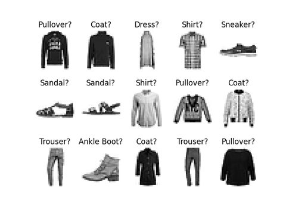

<!-- Apply header and footer to first slide only -->
<!-- _header: "" -->
<!-- _footer: "[Baptiste Pesquet](https://www.bpesquet.fr)" -->
<!-- headingDivider: 3 -->

# Convolutional Neural Network with PyTorch

<!-- Show pagination, starting with second slide -->
<!-- paginate: true -->

## Scope and objective

This example trains a convolutional neural network to classify fashion items. The complete sourse code is available [here](test_convolutional_neural_network.py).

