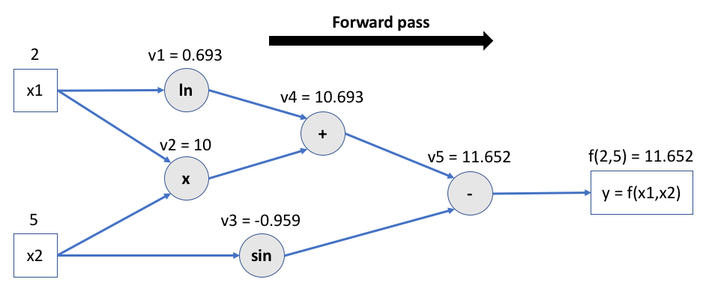
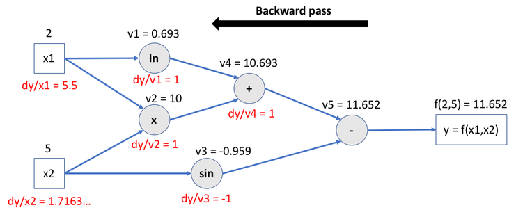

<!-- Apply header and footer to first slide only -->
<!-- _header: "[](https://ensc.bordeaux-inp.fr)" -->
<!-- _footer: "[Baptiste Pesquet](https://www.bpesquet.fr)" -->
<!-- headingDivider: 3 -->

# PyTorch Fundamentals

<!-- Show pagination, starting with second slide -->
<!-- paginate: true -->

## PyTorch in a nutshell

[PyTorch](https://pytorch.org/) can be described as the combination of:

- a tensor library;
- an automatic differentiation engine;
- an API for defining and training neural networks.

This [example](test_fundamentals.py) focuses on its fundamentals aspects: tensor manipulation, GPU support, autodifferentiation, data and model loading/saving.

## Importing PyTorch

First and foremost, we need to import [torch](https://pytorch.org/docs/stable/torch.html), the core package of PyTorch.

> [!NOTE]
> Depending on your context, the library may already be available on your system and ready to be imported. For example, this is the case in most cloud-based notebook execution platforms like [Google Colaboratory](https://colab.research.google.com/). Refer to its [documentation](https://pytorch.org/get-started/locally/) if you need to install PyTorch on your local environment.

```python
import torch

# Optional: print PyTorch version for debugging purposes
# print(f"Using PyTorch {torch.__version__}")
```

---

This example also uses several additional libraries that you must import using the following code.

> [!NOTE]
> You might need to install the [scikit-learn](https://scikit-learn.org) and [torchvision](https://pytorch.org/vision/stable/index.html) packages beforehand.

```python
import math
import numpy as np
from sklearn.datasets import make_circles
from torch.utils.data import Dataset, DataLoader
from torchvision import datasets, transforms, models
```

## Tensor manipulation

Tensors are the core data structures of Machine Learning. A **tensor** is a fancy name for a multidimensional numerical array: a set of primitive values (almost always numbers) shaped into an array of any number of *dimensions*.

- A tensor’s dimension is also called an *axis*.
- The number of dimensions (or axes) of a tensor is called its *rank*.
- A tensor’s *shape* describes the number of values along each dimension/axis.

PyTorch tensors are quite similar to [NumPy](https://numpy.org)’s [ndarrays](https://numpy.org/doc/stable/reference/generated/numpy.array.html), except for the following key differences:

- they can run on GPUs or other hardware accelerators;
- they are optimized for automatic differentiation (see below for details).

### Tensor creation

Tensors have attributes describing their shape, datatype, and the device on which they are stored (more on that below).

They can be created in various ways. Here are some examples.

---

> [!NOTE]
> The [assert](https://docs.python.org/3/reference/simple_stmts.html#grammar-token-python-grammar-assert_stmt) statements are used to check (and also illustrate) the expected results of previous statements.

```python
# Create a 1D tensor with predefined values
x = torch.tensor([5.5, 3])
assert x.shape == torch.Size([2])
assert x.dtype == torch.float32
assert x.device == torch.device(type="cpu")

# Create a 2D tensor filled with random integers.
# Values are generated uniformly between the low and high (excluded) bounds
x = torch.randint(low=0, high=100, size=(5, 3))
assert x.shape == torch.Size([5, 3])
assert x.dtype == torch.int64
assert x.device == torch.device(type="cpu")
```

### Operations on tensors

Many operations can be applied to tensor: transposing, indexing, slicing, mathematical operations, linear algebra, random sampling, and more!

```python
# Addition operator
y1 = x + 2

# Addition method, obtaining (logically) an identical result
y2 = torch.add(x, 2)
assert torch.equal(y1, y2)
```

---

#### Cloning and in-place operations

By default, operations don't mutate (update) the tensor on which they are applied. This behavior can be changed by using in-place operations, denoted by a `_` suffix.

Obtaining a deep copy of a tensor can be achieved by using the [clone()](https://pytorch.org/docs/stable/generated/torch.clone.html) function.

```python
# Create a deep copy of a tensor (allocating new memory).
# detach() removes its output from the computational graph (no gradient computation).
# See below for details about gradients.
# See also https://stackoverflow.com/a/62496418
x_clone = x.detach().clone()

# In-place addition: tensor is mutated
x.add_(2)
assert torch.equal(x, x_clone + 2)
```

---

#### Indexing and slicing

Indexing and slicing tensors work very similar to the Python/NumPy API.

```python
# NumPy-like indexing and slicing: update all values of second axis
x[:, 1] = 0
```

### Shape management

A common operation on tensors is *reshaping*: defining a new shape without changing the underlying data. PyTorch offers two main ways of rehsaping tensors:

- [view()](https://pytorch.org/docs/stable/generated/torch.Tensor.view.html#torch.Tensor.view), which returns a new tensor sharing memory with the original one;
- [reshape()](https://pytorch.org/docs/stable/generated/torch.reshape.html), which either returns a view or creates a copy of the original tensor.

```python
# PyTorch allows a tensor to be a view of an existing tensor.
# View tensors share the same underlying memory with their base tensor.
# Example : reshaping a 2D tensor into a 1D tensor (a vector)
x_view = x.view(15)
assert x_view.shape == torch.Size([15])

# Like with Python/NumPy, the dimension identified by -1 is inferred from other dimensions
assert x.view(-1, 5).shape == torch.Size([3, 5])
assert x.view(-1,).shape == torch.Size([15])

# The reshape() function mimics the NumPy API.
# Example: reshaping into a (3,5) tensor (creating a view if possible)
assert x.reshape(3, -1).shape == torch.Size([3, 5])
```

### Bridge with NumPy

Tensors can be created from NumPy arrays, and vice-versa.

> [!CAUTION]
> Tensors stored on the CPU memory and NumPy arrays can share their underlying memory locations. Changing one will change the other.

---

```python
# Number of values in the next arrays/tensors
n_values = 5

# Create a PyTorch tensor from a NumPy array
n = np.ones(n_values)
t = torch.from_numpy(n)
assert t.shape == torch.Size([n_values])
# Updating the array mutates the tensor
np.add(n, 1, out=n)
assert torch.equal(t, torch.tensor([2] * n_values))

# Obtain a NumPy array from a PyTorch tensor
t = torch.ones(n_values)
n = t.numpy()
assert n.shape == (n_values,)
# Updating the tensor mutates the array
t.add_(1)
assert np.array_equal(n, np.array([2] * n_values))
```

## GPU support

One of the distinctive features of PyTorch is the support of various hardware accelerators, notably GPUs. This can lead to significant gains when running computationaly intensive operations, such as model training.

PyTorch offers out-of-the-box support for [CUDA](https://developer.nvidia.com/cuda-toolkit) (NVIDIA) and [MPS](https://developer.apple.com/documentation/metalperformanceshaders) (Applce Silicon). The following code tests the availability of one of such devices.

### Initializing a device

To avoid code duplication, we define the device detection code in its own function that we'll reuse in other examples.

```python
def get_device():
    """Return GPU device if available, or fall back to CPU"""

    return torch.device(
        "cuda"
        if torch.cuda.is_available()
        else "mps"
        if torch.backends.mps.is_available()
        else "cpu"
    )


device = get_device()
print(f"PyTorch {torch.__version__}, using {device} device")
```

### Using the initialized device

Once a device is initialized, tensors and models must be created or copied on GPU memory to enable hardware acceleration.

```python
# Create a 1D tensor (filled with the scalar value 1) directly on the memory of the initialized device
_ = torch.ones(5, device=device)

# Create a 2D tensor (filled with zeros) on CPU memory
x_cpu = torch.zeros(2, 3)

# Copy tensor to GPU memory (if available)
x_device = x_cpu.to(device)

# Create a copy of a GPU-based tensor in CPU memory
_ = x_device.cpu()

# Obtain a NumPy array from a GPU-based tensor
_ = x_device.detach().cpu().numpy()
```

## Autodifferentiation

Another key feature of PyTorch is the inclusion of an *autodifferentiation engine*, called [autograd](https://pytorch.org/docs/stable/autograd.html). This enables the efficient computation of derivatives of numeric functions, math expressions, and also algorithms using branching, loops or recursion.

This is how PyTorch greatly simplifies the computation of *gradients* needed during the training process of neural networks.

### Basic example

Let's start with a very simple exemple using scalars: the function $f(x) = w*x +b$

```python
# Create scalar tensors with gradient computation activated.
# (By default, operations are not tracked on user-created tensors)
x = torch.tensor(1.0, requires_grad=True)
w = torch.tensor(2.0, requires_grad=True)
b = torch.tensor(3.0, requires_grad=True)

# Apply operations
y = w * x + b
assert y.requires_grad is True
```

---

When its `requires_grad` attribute is set to `True`, PyTorch records all aperations applied to a tensor in a directed acyclic graph (DAG) called a *computational graph*. By traversing this graph backwards, it can automatically compute the gradients (derivatives w.r.t. each tensor involved) of applied operations using the [chain rule](https://en.wikipedia.org/wiki/Chain_rule).

The backward pass kicks off when `.backward()` is called on the root of the graph, i.e. the output tensor(s).

For the previous example, we check that $\frac{\partial f(x)}{\partial x} = w$, $\frac{\partial f(x)}{\partial w} = x$ and $\frac{\partial f(x)}{\partial b} = 1$.

```python
# Compute gradients of operations leading up to this tennsor
y.backward()

# Print the gradients
assert x.grad == 2  # x.grad = dy/dx = w
assert w.grad == 1  # w.grad = dy/dw = x
assert b.grad == 1  # b.grad = dy/db
```

---

When gradients computation is not needed (such as when using a trained model in inference mode), the `no_grad()` function avoids the associated overhead.

```python
# no_grad() avoids tracking operations history when gradients computation is not needed
with torch.no_grad():
    y_no = w * x + b
    assert y_no.requires_grad is False
```

### Multivariate example

Here is a slighly more complex example using the function $f(x_1,x_2) = log_e(x_1) + x_1x_2 - sin(x_2)$.

```python
# Create two scalar tensors with gradient computation activated
x1 = torch.tensor([2.0], requires_grad=True)
x2 = torch.tensor([5.0], requires_grad=True)

# y = f(x1,x2) = ln(x1) + x1.x2 - sin(x2)
v1 = torch.log(x1)
v2 = x1 * x2
v3 = torch.sin(x2)
v4 = v1 + v2
y = v4 - v3
```

---

The previous code creates the following computational graph. Each node stores the intermediate operation leading up to the final result.



---

Backwards traversal computes the gradients for each operation, accumulates them in the respective tensor’s `.grad` attribute, and propagates all the way to the leaf (input) tensors.



> [!NOTE]
> Learn more about [mathematical details for this backward pass](https://github.com/bpesquet/mlcourse/tree/main/lectures/gradient_descent#step-2-backward-pass).

---

As expected, $\frac{\partial}{\partial x_1}f(x_1,x_2) = \frac{1}{x_1} + x_2$ and $\frac{\partial}{\partial x_2}f(x_1,x_2) = x_1 - cos(x_2)$.

```python
# Compute gradients
y.backward()

# dy/dx1 = 1/x1 + x2 = 1/2 + 5
assert x1.grad == 5.5
# dy/dx2 = x1 - cos(x2) = 2 - cos(5) = 1.7163...
assert x2.grad == 2 - torch.cos(torch.tensor(5))
```

## Dataset loading

PyTorch provides several utilities for dealing with datasets.

### Using an integrated dataset

The [torchvision](https://pytorch.org/vision/stable/index.html) package (a part of PyTorch) provides many built-in datasets. All of them have a similar API. They all have two common arguments: `transform` and `target_transform` to transform the input and target respectively.

---

#### Dataset download

The following code downloads the famous MNIST handwritten digits dataset, then tests its first element.

```python
# Directory for downloaded files
DATA_DIR = "./.output"

# Download and construct the MNIST handwritten digits training dataset
mnist = datasets.MNIST(
    root=DATA_DIR, train=True, transform=transforms.ToTensor(), download=True
)

# Fetch one data pair (read data from disk)
image, label = mnist[0]
# MNIST samples are bitmap images of shape (color_depth, height, width).
# Color depth is 1 for grayscale images
assert image.shape == torch.Size([1, 28, 28])
# Image label is a scalar value
assert isinstance(label, int)
```

### Batch data loading

Once a dataset is downloaded, the [DataLoader](https://pytorch.org/docs/stable/data.html#torch.utils.data.DataLoader) class provides randomized batched iteration over it, a feature often needed during model training.

```python
# Number of samples in each batch
batch_size = 32

# Data loader (this provides queues and threads in a very simple way).
mnist_dataloader = DataLoader(dataset=mnist, batch_size=batch_size, shuffle=True)

# Number of batches in a training epoch (= n_samples / batch_size, rounded up)
n_batches = len(mnist_dataloader)
assert n_batches == math.ceil(len(mnist) / batch_size)
```

---

```python
# Loop-based iteration is the most convenient way to train models on batched data
for x_batch, y_batch in mnist_dataloader:
    # x_batch contains inputs for the current batch
    assert x_batch.shape == torch.Size([batch_size, 1, 28, 28])
    # y_batch contains targets for the current batch
    assert y_batch.shape == torch.Size([batch_size])

    # ... (Training code for the current batch should be written here)
```

### Using a scikit-learn dataset

You can also use a `DataLoader` to process any dataset, such as in this example whichs uses the scikit-learn [make_circles()](https://scikit-learn.org/1.5/modules/generated/sklearn.datasets.make_circles.html) function to create a 2D dataset.

```python
# Number of generated samples
n_samples = 500

# Generate 2D data (two concentric circles)
inputs, targets = make_circles(n_samples=n_samples, noise=0.1, factor=0.3)
assert inputs.shape == (n_samples, 2)
assert targets.shape == (n_samples,)
```

---

```python
# Create tensor for inputs
x_train = torch.from_numpy(inputs).float()
assert x_train.shape == torch.Size([n_samples, 2])

# Create tensor for targets (labels)
# PyTorch loss functions expect float results of shape (batch_size, 1) instead of (batch_size,)
# So we add a new axis and convert them to floats
y_train = torch.from_numpy(targets[:, np.newaxis]).float()
assert y_train.shape == torch.Size([n_samples, 1])

# Load data as randomized batches for training
circles_dataloader = DataLoader(
    list(zip(x_train, y_train)), batch_size=batch_size, shuffle=True
)

# Number of batches in a training epoch (= n_samples / batch_size, rounded up)
n_batches = len(circles_dataloader)
assert n_batches == math.ceil(n_samples / batch_size)

# ... (Use dataloader as seen above)
```

### Using a custom dataset

Lastly, PyTorch makes it possible to load custom datasets via the creation of a dedicated class inheriting from [Dataset](https://pytorch.org/docs/stable/data.html#torch.utils.data.Dataset) that must implement three functions: `__init__`, `__len__`, and `__getitem__`.

```python
class CustomDataset(Dataset):
    """A custom Dataset class"""

    def __init__(self):
        # ... Init internal state (file paths, etc)

    def __len__(self):
        # ... Return the number of samples in the dataset

    def __getitem__(self, index):
        # ... Load, preprocess and return one data sample (inputs and label)
```

---

Once a custom dataset is instantiated, it can be used by a `DataLoader` as seen above.

```python
custom_dataset = CustomDataset()

custom_dataloader = DataLoader(dataset=custom_dataset,       
    batch_size=batch_size, shuffle=True)

# ... (Use dataloader for batched access to data)
```

> [!TIP]
> Learn more about [creating a custom Dataset class](https://pytorch.org/tutorials/beginner/basics/data_tutorial.html#creating-a-custom-dataset-for-your-files).

## Model loading and saving

The [torchvision](https://pytorch.org/vision/stable/index.html) package includes several famous pre-trained vision models like [AlexNet](https://pytorch.org/vision/stable/models/alexnet.html), [VGG](https://pytorch.org/vision/stable/models/vgg.html) or [ResNet](https://pytorch.org/vision/stable/models/resnet.html).

Models store their learned parameters in an internal state dictionary called `state_dict`. These can be persisted via the [torch.save()](https://pytorch.org/docs/main/generated/torch.save.html) method.

---

```python
# Directory for saved model weights
MODEL_DIR = "./.output"

# Download and load the pretrained model ResNet-18
resnet = models.resnet18(weights="ResNet18_Weights.DEFAULT")

# Optional: copy downloaded model to device memory for hardware acceleration.
# Make sure to call input = input.to(device) on any input tensors that you feed to the model
resnet = resnet.to(device)

# Save model parameters (recommended way of saving models)
resnet_weights_filepath = f"{MODEL_DIR}/resnet_weights.pth"
torch.save(resnet.state_dict(), resnet_weights_filepath)
```

---

The process for loading a model includes re-creating the model structure and loading the state dictionary into it.

Previously saved weights can be loaded via the [torch.load()](https://pytorch.org/docs/stable/generated/torch.load.html)  function.

```python
# Load untrained model ResNet-18 on device momory
resnet = models.resnet18().to(device)

# Load saved weights (results of the training process)
resnet.load_state_dict(torch.load(resnet_weights_filepath, weights_only=True))

# Set model to evaluation mode (needed for consistent inference results).
# Model is now ready for inference
resnet.eval()
```

## Additional resources

- [PyTorch Cheat Sheet](https://pytorch.org/tutorials/beginner/ptcheat.html)
- [PyTorch: Learn the Basics](https://pytorch.org/tutorials/beginner/basics/intro.html)
- [Deep Learning with PyTorch: A 60 Minute Blitz](https://pytorch.org/tutorials/beginner/deep_learning_60min_blitz.html)
- [Introduction to PyTorch - YouTube Series](https://pytorch.org/tutorials/beginner/introyt/introyt_index.html)
- [What is torch.nn really?](https://pytorch.org/tutorials/beginner/nn_tutorial.html)
- [Writing Custom Datasets, DataLoaders and Transforms](https://pytorch.org/tutorials/beginner/data_loading_tutorial.html)
