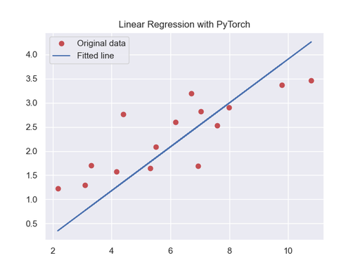

<!-- Apply header and footer to first slide only -->
<!-- _header: "[](https://ensc.bordeaux-inp.fr)" -->
<!-- _footer: "[Baptiste Pesquet](https://www.bpesquet.fr)" -->
<!-- headingDivider: 3 -->

# Linear Regression with PyTorch

<!-- Show pagination, starting with second slide -->
<!-- paginate: true -->

> The Python source file is [available here](test_linear_regression.py).

## Scope and objective

This example trains a Linear Regression model on a minimalist 2D dataset.



## Imports

First of all, we need to import the necessary stuff.

```python
import numpy as np
import matplotlib.pyplot as plt
import seaborn as sns
import torch
from torch import nn
```

## GPU support

Let's probe for the availability of an accelerated device.

```python
# Access GPU device if available, or fail back to CPU
device = torch.device(
    "cuda"
    if torch.cuda.is_available()
    else "mps"
    if torch.backends.mps.is_available()
    else "cpu"
)
print(f"PyTorch {torch.__version__}, using {device} device")
```

## Hyperparameters

Next, we define the various hyperparameters for this example.

```python
# Hyperparameters
n_epochs = 60  # Number of training iterations on the whole dataset
learning_rate = 0.001  # Rate of parameter change during gradient descent
```

## Dataset loading

To keep things as simple as possible, the dataset is created from scratch as two NumPy arrays: `ìnputs` (x-coordinates of the samples) and `targets` (corresponding y-coordinates of the samples).

### Data generation

```python
# Toy dataset: inputs and expected results
inputs = np.array(
[
    [3.3],  [4.4], [5.5], [6.71], [6.93], [4.168], [9.779], [6.182],
    [7.59], [2.167], [7.042], [10.791], [5.313], [7.997], [3.1],
],
dtype=np.float32,
)
targets = np.array(
[
    [1.7], [2.76], [2.09], [3.19], [1.694], [1.573], [3.366], [2.596],
    [2.53], [1.221], [2.827], [3.465], [1.65], [2.904], [1.3],
],
dtype=np.float32,
)

print(f"Inputs: {inputs.shape}. targets: {targets.shape}")
```

### Conversion to PyTorch tensors

Both inputs and targets are subsequently converted to PyTorch tensors stored into the device memory.

```python
# Convert dataset to PyTorch tensors and put them on GPU memory (if available)
x_train = torch.from_numpy(inputs).to(device)
y_train = torch.from_numpy(targets).to(device)
```

## Model definition

The Linear Regression model is implemented with the PyTorch [Linear](https://pytorch.org/docs/stable/generated/torch.nn.Linear.html) class, which applies an affine tranformation to its input.

This model has one input (the x-coordinate of a sample) and one output (its y-coordinate).

```python
# Create a Linear Regression model and put it on GPU memory
model = nn.Linear(in_features=1, out_features=1).to(device)
```

### Parameter count

The model defines a function $f(x) = w_0 + w_1 x$. It has two parameters: $w_0$ and $w_1$.

```python
# Print model architecture
print(model)

# Compute and print parameter count
n_params = sum(p.numel() for p in model.parameters() if p.requires_grad)
print(f"Model has {n_params} trainable parameters")
# Linear layers have (in_features + 1) * out_features parameters
assert n_params == 2
```

## Loss function

The [MSELoss](https://pytorch.org/docs/stable/generated/torch.nn.MSELoss.html) class implements the Mean Squared Error loss function, well suited to regression tasks.

```python
# Use Mean Squared Error loss
criterion = nn.MSELoss()
```

## Training loop

The loop for training a PyTorch model in a supervised way is always composed of four main parts:

1. compute the model outputs for a set of inputs;
2. compute the value of the loss function (difference between expected and actual values);
3. use autodiff to obtain the gradients of the loss functions w.r.t each model parameter;
4. update each parameter in the opposite direction of its gradient.

---

In this first example, the training loop is implemented in the simplest way possible.

- No batching: due to the small sample count, the whole dataset is used at each epoch (training iteration).
- Model parameters are updated manually rather than by using a pre-built optimizer. This choice is made to better illustrate the gradient descent algorithm.

Subsequent examples will use more standard techniques.

---

```python
# Set the model to training mode - important for batch normalization and dropout layers.
# Unnecessary here but added for best practices
model.train()

# Train the model
for epoch in range(n_epochs):
    # Forward pass
    y_pred = model(x_train)

    # Compute loss value
    loss = criterion(y_pred, y_train)

    # Reset the gradients to zero before running the backward pass.
    # Avoids accumulating gradients between GD steps
    model.zero_grad()

    # Compute gradients
    loss.backward()

    # no_grad() avoids tracking operations history when gradients computation is not needed
    with torch.no_grad():
        # Manual gradient descent step: update the weights in the opposite direction of their gradient
        for param in model.parameters():
            param -= learning_rate * param.grad

    # Print training progression
    if (epoch + 1) % 5 == 0:
        print(
            f"Epoch [{(epoch + 1):3}/{n_epochs:3}] finished. Loss: {loss.item():.5f}"
        )
```

## Results plotting

Finally, model predictions (fitted line) are plotted alongside training data.

> [!NOTE]
> The `plot_2d_data()` utility function is defined below.

```python
# Improve plots appearance
sns.set_theme()

_ = plot_2d_data(
    model=model, x=x_train, y=y_train, title="Linear Regression with PyTorch"
)
plt.show()
```

---

```python
def plot_2d_data(x, y, model, title):
    """
    Plot 2D data and model predictions.

    Args:
        model (torch.nn.Module): Trained PyTorch model
        x (torch.Tensor): Input features of shape (n_samples, 2)
        y (torch.Tensor): Labels of shape (n_samples,)
        title (str): Plot title
    """
    # Set the model to evaluation mode - important for batch normalization and dropout layers.
    # Unnecessary here but added for best practices
    model.eval()

    # Compute model results on training data, and convert them to a NumPy array
    y_pred = model(x).detach().cpu().numpy()

    # Convert inputs and targets to NumPy arrays
    x_cpu = x.detach().cpu().numpy()
    y_cpu = y.detach().cpu().numpy()

    # Plot the training results
    plt.plot(x_cpu, y_cpu, "ro", label="Original data")
    plt.plot(x_cpu, y_pred, label="Fitted line")
    plt.legend()
    plt.title(title)

    return plt.gcf()
```
