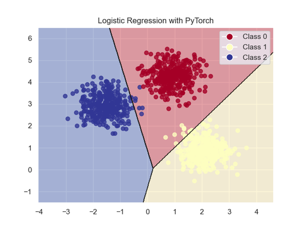

<!-- Apply header and footer to first slide only -->
<!-- _header: "[](https://ensc.bordeaux-inp.fr)" -->
<!-- _footer: "[Baptiste Pesquet](https://www.bpesquet.fr)" -->
<!-- headingDivider: 3 -->

# Logistic Regression with PyTorch

<!-- Show pagination, starting with second slide -->
<!-- paginate: true -->

> The Python source file is [available here](test_logistic_regression.py).

## Scope and objective

This example trains a Logistic Regression classifier (equivalent to a feedforward neural network without any hidden layer) on a 2D dataset.



## Imports

As usual, we start by importing the necessary packages.

```python
import math
import matplotlib.pyplot as plt
from matplotlib.colors import ListedColormap
import seaborn as sns
from sklearn.datasets import make_blobs
import torch
from torch import nn
from torch.utils.data import DataLoader
```

## GPU support

```python
# Access GPU device if available, or fail back to CPU
device = torch.device(
    "cuda"
    if torch.cuda.is_available()
    else "mps"
    if torch.backends.mps.is_available()
    else "cpu"
)
print(f"PyTorch {torch.__version__}, using {device} device")
```

## Hyperparameters

Feel free to choose different values and check their impact on the training outcome.

```python
# Hyperparameters
n_samples = 1000  # Number of data samples
output_dim = 3  # Number of classes
n_epochs = 60  # Number of training iterations on the whole dataset
learning_rate = 0.001  # Rate of parameter change during gradient descent
batch_size = 32  # Number of samples used for one gradient descent step
```

## Dataset loading

### Data generation

A [scikit-learn function](https://scikit-learn.org/stable/modules/generated/sklearn.datasets.make_blobs.html) is used to generate a simple 2D dataset. The number of classes is defined by the `output_dim` hyperparameter.

```python
# Generate a 2D dataset with scikit-learn
inputs, targets = make_blobs(
    n_samples=n_samples,
    n_features=2,  # x- and y-coordinates
    centers=output_dim,
    cluster_std=0.5,
    random_state=0,
)
print(f"Inputs: {inputs.shape}. targets: {targets.shape}")
assert inputs.shape == (n_samples, 2)
assert targets.shape == (n_samples,)
```

### Conversion to PyTorch tensors

Inputs and targets are converted to PyTorch tensors and put on GPU memory (if available).

```python
# Convert dataset to PyTorch tensors and put them on GPU memory (if available)
x_train = torch.from_numpy(inputs).float().to(device)
y_train = torch.from_numpy(targets).int().to(device)
```

### Batch loading

The PyTorch [DataLoader](https://pytorch.org/docs/stable/data.html#torch.utils.data.DataLoader) class is used to load data in batches during model training.

```python
# Create data loader for loading data as randomized batches
train_dataloader = DataLoader(
    list(zip(x_train, y_train)), batch_size=batch_size, shuffle=True
)

# Number of batches in an epoch (= n_samples / batch_size, rounded up)
n_batches = len(train_dataloader)
assert n_batches == math.ceil(n_samples / batch_size)
```

## Model definition

The Logistic Regression model is implemented with the PyTorch [Linear](https://pytorch.org/docs/stable/generated/torch.nn.Linear.html) class.

This model has two inputs (the x- and y-coordinates of a sample) and as many outputs as the number of classes.

```python
# Create a logistic regression model for the 2D dataset
model = nn.Linear(in_features=2, out_features=output_dim).to(device)

# Print model architecture
print(model)
```

### Parameter count

The number of parameters for this model is equal to the number of entries multiplied by the number of classes. We must take into account the biases (additional entries always equal to 1).

```python
# Compute and print parameter count
n_params = sum(p.numel() for p in model.parameters() if p.requires_grad)
print(f"Model has {n_params} trainable parameters")
# Linear layers have (in_features + 1) * out_features parameters
assert n_params == 3 * output_dim
```

## Loss function

This multiclass classification example uses the [cross-entropy](https://github.com/bpesquet/mlcourse/tree/main/lectures/classification_performance#assessing-performance-during-training-1) a.k.a. negative log-likelihood loss function, implemented by the [CrossEntropyLoss](https://pytorch.org/docs/stable/generated/torch.nn.CrossEntropyLoss.html) class.

> [!NOTE]
> PyTorch also offers the [NLLLoss](https://pytorch.org/docs/stable/generated/torch.nn.NLLLoss.html#torch.nn.NLLLoss) class implementing the negative log-likelihood loss. A key difference is that `CrossEntropyLoss` expects *logits*  (raw, unnormalized predictions) as inputs, and uses [LogSoftmax](https://pytorch.org/docs/stable/generated/torch.nn.LogSoftmax.html#torch.nn.LogSoftmax) to transform them into probabilities before computing its output. Using `CrossEntropyLoss` is equivalent to applying `LogSoftmax` followed by `NLLLoss` ([more details](https://towardsdatascience.com/cross-entropy-negative-log-likelihood-and-all-that-jazz-47a95bd2e81)).

```python
# Use cross-entropy loss function for this multiclass classification task.
# Softmax is computed internally to convert outputs into probabilities
criterion = nn.CrossEntropyLoss()
```

## Gradient descent optimizer

Several [optimizers](https://pytorch.org/docs/stable/optim.html) can be used to update the model's parameters during gradient descent.

Here, we use the simplest one: [SGD](https://pytorch.org/docs/stable/generated/torch.optim.SGD.html), for a vanilla Stochastic Gradient Descent without any refinement.

```python
# Use a vanilla mini-batch stochastic gradient descent optimizer
optimizer = torch.optim.SGD(model.parameters(), lr=learning_rate)
```

## Training loop

We now implement the canonical PyTorch training loop.

Contrary to the [previous example](../linear_regression/README.md#training-loop), we load data as batches rather than using the whole dataset at each step of the gradient descent process. The latter would be resource-inefficient and is never used in practice.

---

```python
# Set the model to training mode - important for batch normalization and dropout layers.
# Unnecessary here but added for best practices
model.train()

# Train the model
for epoch in range(n_epochs):
    # Total loss for epoch, divided by number of batches to obtain mean loss
    epoch_loss = 0

    # Number of correct predictions in an epoch, used to compute epoch accuracy
    n_correct = 0

    # For each batch of data
    for x_batch, y_batch in train_dataloader:
        # Forward pass
        y_pred = model(x_batch)

        # Compute loss value
        loss = criterion(y_pred, y_batch)

        # Gradient descent step
        optimizer.zero_grad()
        loss.backward()
        optimizer.step()

        with torch.no_grad():
            # Accumulate data for epoch metrics: loss and number of correct predictions
            epoch_loss += loss.item()
            n_correct += (
                (model(x_batch).argmax(dim=1) == y_batch).float().sum().item()
            )

    # Compute epoch metrics
    mean_loss = epoch_loss / n_batches
    epoch_acc = n_correct / n_samples

    if (epoch + 1) % 5 == 0:
        print(
            f"Epoch [{(epoch + 1):3}/{n_epochs:3}] finished. Mean loss: {mean_loss:.5f}. Accuracy: {epoch_acc * 100:.2f}%"
        )
```

## Results plotting

Finally, we plot the data and decision boundaries (model prediction for each region of the 2D plane) for this example.

> [!NOTE]
> The `plot_decision_boundaries()` utility function is defined below.

```python
# Improve plots appearance
sns.set_theme()

_ = plot_decision_boundaries(
    model=model,
    x=x_train,
    y=y_train,
    title="Logistic Regression with PyTorch",
    device=device,
)
plt.show()
```

---

```python
def plot_decision_boundaries(model, x, y, title, device):
    """
    Plot the decision boundaries and data points for a PyTorch classifier.

    Args:
        model (torch.nn.Module): Trained PyTorch model
        inputs (torch.Tensor): Input features of shape (n_samples, 2)
        targets (torch.Tensor): Labels of shape (n_samples,)
        title (str): Plot title
        device (torch.device): device where data on model are stored
    """
    # Set the model to evaluation mode - important for batch normalization and dropout layers.
    # Unnecessary here but added for best practices
    model.eval()

    # Convert inputs and targets to NumPy arrays
    x_cpu = x.detach().cpu().numpy()
    y_cpu = y.detach().cpu().numpy()

    # Determine bounds for the grid
    x_min, x_max = x_cpu[:, 0].min() - 1, x_cpu[:, 0].max() + 1
    y_min, y_max = x_cpu[:, 1].min() - 1, x_cpu[:, 1].max() + 1

    # Generate a grid of points with distance h between them
    h = 0.02
    xx, yy = np.meshgrid(np.arange(x_min, x_max, h), np.arange(y_min, y_max, h))

    # Convert mesh to PyTorch tensors and put it on device memory
    x_mesh = torch.tensor(np.c_[xx.ravel(), yy.ravel()], dtype=torch.float).to(device)

    # Get predictions for mesh points
    with torch.no_grad():
        y_mesh = model(x_mesh).detach().cpu()
        if y_mesh.shape[1] > 1:  # For multi-class problems
            y_mesh = torch.argmax(y_mesh, dim=1)

            # Reshape predictions to match mesh shape
            y_mesh = y_mesh.numpy().reshape(xx.shape)

            # Create the plot
            plt.figure()

            # Plot decision boundaries
            plt.contourf(xx, yy, y_mesh, alpha=0.4, cmap="RdYlBu")
            plt.contour(xx, yy, y_mesh, colors="k", linewidths=0.5)

            # Plot data points
            scatter = plt.scatter(
                x_cpu[:, 0], x_cpu[:, 1], c=y_cpu, cmap="RdYlBu", linewidth=1, alpha=0.8
            )
        else:  # For binary classification
            # Reshape predictions to match mesh shape
            y_mesh = y_mesh.numpy().reshape(xx.shape)

            # Create the plot
            plt.figure()

            # Plot decision boundary
            plt.contourf(xx, yy, y_mesh, cmap=plt.colormaps.get_cmap("Spectral"))

            # Plot data points
            cm_bright = ListedColormap(["#FF0000", "#0000FF"])
            scatter = plt.scatter(x_cpu[:, 0], x_cpu[:, 1], c=y_cpu, cmap=cm_bright)

    # Add legend
    unique_labels = np.unique(y_cpu)
    legend_elements = [
        plt.Line2D(
            [0],
            [0],
            marker="o",
            color="w",
            markerfacecolor=scatter.cmap(scatter.norm(label.item())),
            markersize=10,
            label=f"Class {label.item():.0f}",
        )
        for label in unique_labels
    ]
    plt.legend(handles=legend_elements)

    plt.title(title)

    return plt.gcf()
```
