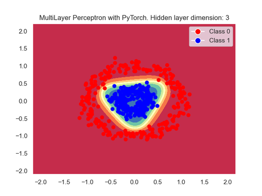

<!-- Apply header and footer to first slide only -->
<!-- _header: "[](https://ensc.bordeaux-inp.fr)" -->
<!-- _footer: "[Baptiste Pesquet](https://www.bpesquet.fr)" -->
<!-- headingDivider: 3 -->

# MultiLayer Perceptron with PyTorch

<!-- Show pagination, starting with second slide -->
<!-- paginate: true -->

## Scope and objective

This example trains a MultiLayer Perceptron (a feedforward neural network with one hidden layer) to classify 2D data. It is designed to mimic the experience of the [TensorFlow Playground](https://playground.tensorflow.org/#activation=tanh&batchSize=5&dataset=circle&regDataset=reg-plane&learningRate=0.1&regularizationRate=0&noise=0&networkShape=3&seed=0.94779&showTestData=false&discretize=false&percTrainData=50&x=true&y=true&xTimesY=false&xSquared=false&ySquared=false&cosX=false&sinX=false&cosY=false&sinY=false&collectStats=false&problem=classification&initZero=false&hideText=false)). The complete sourse code is available [here](test_multilayer_perceptron.py).



## Imports

As usual, we start by importing the necessary packages.

```python
import math
import numpy as np
import matplotlib.pyplot as plt
import seaborn as sns
from sklearn.datasets import make_circles
import torch
from torch import nn
from torch.utils.data import DataLoader
```

## GPU support

> [!NOTE]
> The `get_device()` utility function was defined in a [previous example](../fundamentals/README.md#gpu-support)

```python
device = get_device()
print(f"PyTorch {torch.__version__}, using {device} device")
```

## Hyperparameters

Feel free to choose different values and check their impact on the training outcome.

```python
# Hyperparameters
n_samples = 500  # Number of data samples
hidden_layer_dim = 3  # Number of neurons on the hidden layer of the MLP
n_epochs = 50  # Number of training iterations on the whole dataset
learning_rate = 0.1  # Rate of parameter change during gradient descent
batch_size = 5  # Number of samples used for one gradient descent step
```

## Dataset loading

### Data generation

A [scikit-learn function](https://scikit-learn.org/stable/modules/generated/sklearn.datasets.make_circles.html) is used to generate a simple 2D dataset.

```python
# Generate 2D data (a large circle containing a smaller circle)
inputs, targets = make_circles(n_samples=n_samples, noise=0.1, factor=0.3)
print(f"Inputs: {inputs.shape}. targets: {targets.shape}")
assert inputs.shape == (n_samples, 2)
assert targets.shape == (n_samples,)
```

### Conversion to PyTorch tensors

Inputs and targets are converted to PyTorch tensors and put on GPU memory (if available).

We add one dimension to the `targets` tensor so that it is compatible with the loos function used in this example.

```python
# Convert inputs to a PyTorch tensor and put it on GPU memory (if available)
x_train = torch.from_numpy(inputs).float().to(device)
assert x_train.shape == torch.Size([n_samples, 2])

# Convert targets to a PyTorch tensor and put it on GPU memory (if available).
# PyTorch loss function expects float results of shape (batch_size, 1) instead of (batch_size,).
# So we add a new axis and convert them to floats
y_train = torch.from_numpy(targets[:, np.newaxis]).float().to(device)
assert y_train.shape == torch.Size([n_samples, 1])
```

### Batch loading

The PyTorch [DataLoader](https://pytorch.org/docs/stable/data.html#torch.utils.data.DataLoader) class is used to load data in batches during model training.

```python
# Create data loader for loading data as randomized batches
train_dataloader = DataLoader(
    list(zip(x_train, y_train)), batch_size=batch_size, shuffle=True
)

# Number of batches in an epoch (= n_samples / batch_size, rounded up)
n_batches = len(train_dataloader)
assert n_batches == math.ceil(n_samples / batch_size)
```

## Model definition

A PyTorch model is defined by combining elementary blocks, known as *modules*.

Here, we use the [Sequential](https://pytorch.org/docs/stable/generated/torch.nn.Sequential.html) class as a container of [Linear](https://pytorch.org/docs/stable/generated/torch.nn.Linear.html) layers. The model ouput is a scalar value squashed into the $[0,1]$ range by the [Sigmoid](<https://pytorch.org/docs/stable/generated/torch.nn.Sigmoid.html>) activation function.

### Model implementation

```python
# Create a MultiLayer Perceptron with 2 inputs, a hidden layer and 1 output
model = nn.Sequential(
    # Hidden layer
    nn.Linear(in_features=2, out_features=hidden_layer_dim),
    # Activation function for the hidden layer
    nn.Tanh(),
    # Output layer
    nn.Linear(in_features=hidden_layer_dim, out_features=1),
    # Activation function for the output layer
    nn.Sigmoid(),
).to(device)

# Print model architecture
print(model)
```

### Parameter count

The total number of parameters for this model is obtained by summing the parameter counts for the hidden and output layers.

> [!NOTE]
> The `get_parameter_count()` utility function was defined in a [previous example](../linear_regression/README.md#parameter-count).

```python
# Compute and print parameter count
n_params = get_parameter_count(model)
print(f"Model has {n_params} trainable parameters")

# Linear layers have (in_features + 1) * out_features parameters.
# Hidden layer has (2 + 1) * hidden_layer_dim parameters.
# Output layer has (hidden_layer_dim + 1) * 1 parameters
assert n_params == 3 * hidden_layer_dim + hidden_layer_dim + 1
```

## Loss function

For this binary classification task, we use the [binary cross-entropy](https://github.com/bpesquet/mlcourse/tree/main/lectures/classification_performance#choosing-a-loss-function) loss function, implemented bye the PyTorch [BCELoss](https://pytorch.org/docs/stable/generated/torch.nn.BCELoss.html) class.

```python
# Use binary cross-entropy loss function for this binary classification task
criterion = nn.BCELoss()
```

## Gradient descent optimizer

The PyTorch [SGD](https://pytorch.org/docs/stable/generated/torch.optim.SGD.html) class is used to implement a vanilla Stochastic Gradient Descent without any refinement. More sophisticated algorithms like [RMSProp](https://pytorch.org/docs/stable/generated/torch.optim.RMSprop.html) or [Adam](https://pytorch.org/docs/stable/generated/torch.optim.Adam.html) could also have been chosen.

```python
# Use a vanilla mini-batch stochastic gradient descent optimizer
optimizer = torch.optim.SGD(model.parameters(), lr=learning_rate)
```

## Training loop

Training this model is very similar to the [previous example](../logistic_regression/README.md#training-loop).

The only minor difference is the way accuracy is computed by comparing model output (a float in the $[0,1]$ range) to the expected value for a sample (an integer in the $\{0,1\}$ range).

---

```python
# Set the model to training mode - important for batch normalization and dropout layers.
# Unnecessary here but added for best practices
model.train()

# Train the model
for epoch in range(n_epochs):
    # Total loss for epoch, divided by number of batches to obtain mean loss
    epoch_loss = 0

    # Number of correct predictions in an epoch, used to compute epoch accuracy
    n_correct = 0

    # For each batch of data
    for x_batch, y_batch in train_dataloader:
        # Forward pass
        y_pred = model(x_batch)

        # Compute loss value
        loss = criterion(y_pred, y_batch)

        # Gradient descent step
        optimizer.zero_grad()
        loss.backward()
        optimizer.step()

        with torch.no_grad():
            # Accumulate data for epoch metrics: loss and number of correct predictions
            epoch_loss += loss.item()
            n_correct += (
                (torch.round(model(x_batch)) == y_batch).float().sum().item()
            )

    # Compute epoch metrics
    mean_loss = epoch_loss / n_batches
    epoch_acc = n_correct / n_samples

    if (epoch + 1) % 5 == 0:
        print(
            f"Epoch [{(epoch + 1):3}/{n_epochs:3}] finished. Mean loss: {mean_loss:.5f}. Accuracy: {epoch_acc * 100:.2f}%"
        )
```

## Results plotting

After training, we plot the data and decision boundary.

> [!NOTE]
> The `plot_decision_boundaries()` utility function was defined in a [previous example](../logistic_regression/README.md#results-plotting).

```python
# Improve plots appearance
sns.set_theme()

_ = plot_decision_boundaries(
    model=model,
    x=x_train,
    y=y_train,
    title=f"MultiLayer Perceptron with PyTorch. Hidden layer dimension: {hidden_layer_dim}",
    device=device,
)
plt.show()
```
