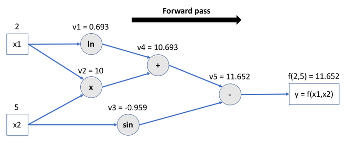
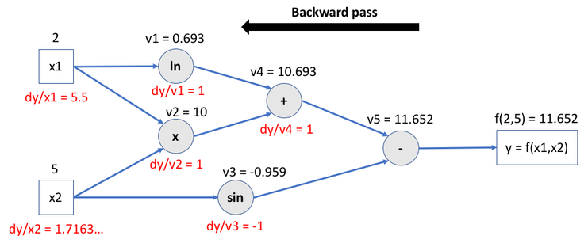

<!-- headingDivider: 3 -->

# PyTorch Fundamentals

In a nutshell, [PyTorch](https://pytorch.org/) can be described as the combination of:

- a tensor manipulation library;
- an automatic differentiation engine;
- an API for defining and training neural networks.

This tutorial focuses on its fundamentals aspects: tensor creation and handling, GPU support, autodifferentiation, data and model loading/saving.

## Importing PyTorch

First and foremost, we need to import PyTorch.

> Depending on your context, the library may already be available on your system and ready to be imported. For example, this is the case in most cloud-based notebook execution platforms like [Google Colaboratory](https://colab.research.google.com/). Refer to its [documentation](https://pytorch.org/get-started/locally/) if you need to install it.

```python
import torch

# Optional: print PyTorch version for debug purposes
# print(f"Using PyTorch {torch.__version__}")
```

---

This tutorial uses several additional libraries that you must import using the following code.

```python
import math
import numpy as np
from sklearn.datasets import make_circles
from torch.utils.data import Dataset, DataLoader
from torchvision import datasets, transforms, models
```

## Tensor manipulation

Tensors are the core data structures of Machine Learning. A **tensor** is a fancy name for a multidimensional numerical array: a set of primitive values (almost always numbers) shaped into an array of any number of *dimensions*.

- A tensor’s dimension is also called an *axis*.
- The number of dimensions (or axes) of a tensor is called its *rank*.
- A tensor’s *shape* describes the number of values along each dimension/axis.

PyTorch tensors are quite similar to [NumPy](https://numpy.org)’s [ndarrays](https://numpy.org/doc/stable/reference/generated/numpy.array.html), except for the following key differences:

- they can run on GPUs or other hardware accelerators;
- they are optimized for automatic differentiation §see below for details).

### Tensor creation

Tensors can be created in various ways. Here are some examples.

> The [assert](https://docs.python.org/3/reference/simple_stmts.html#grammar-token-python-grammar-assert_stmt) statements are used to check (and also illustrate) the expected results of previous statements.

```python
# Create a 1D tensor with predefined values
x = torch.tensor([5.5, 3])
assert x.shape == torch.Size([2])

# Create a 2D tensor filled with random numbers from a uniform distribution
x = torch.rand(5, 3)
assert x.shape == torch.Size([5, 3])
```

### Operations on tensors

PyTorch offers a comprehensive, NumPy-like API for applying operations to tensors.

```python
# Addition operator
y1 = x + 2

# Addition method, obtaining (logically) and identical result
y2 = torch.add(x, 2)
assert torch.equal(y1, y2)

# Create a deep copy of a tensor.
# detach() removes its output from the computational graph (no gradient computation).
# See below for details about gradients.
# See also https://stackoverflow.com/a/62496418
x1 = x.detach().clone()

# In-place addition: tensor is mutated
x.add_(2)
assert torch.equal(x, x1 + 2)
```

---

Indexing and slicing tensors work very similar to the Python/NumPy API.

```python
# Indexing is similar to the Python/NumPy syntax.
# Example: set all values of second column to zero
x[:, 1] = 0
```

### Shape management

A common operation on tensors is *reshaping*: defining a new shape without changing the underlying data. PyTorch offers two main ways of rehsaping tensors:

- [view()](https://pytorch.org/docs/stable/generated/torch.Tensor.view.html#torch.Tensor.view), which returns a new tensor sharing memory with the original one;
- [reshape()](https://pytorch.org/docs/stable/generated/torch.reshape.html), which either returns a view or creates a copy of the original tensor.

```python
# PyTorch allows a tensor to be a view of an existing tensor.
# View tensors share the same underlying memory with their base tensor.
# Example : reshaping a 2D tensor into a 1D tensor (a vector)
x_view = x.view(15)
assert x_view.shape == torch.Size([15])

# Like with Python/NumPy, the dimension identified by -1 is inferred from other dimensions
assert x.view(-1, 5).shape == torch.Size([3, 5])
assert x.view(-1,).shape == torch.Size([15])

# The reshape() function mimics the NumPy API.
# Example: reshaping into a (3,5) tensor (creating a view if possible)
assert x.reshape(3, -1).shape == torch.Size([3, 5])
```

### Bridge with NumPy

Tensors can be created from NumPy arrays, and vice-versa.

```python
# Create a PyTorch tensor from a NumPy array
a = np.random.rand(2, 2)
b = torch.from_numpy(a)
assert b.shape == torch.Size([2, 2])

# Obtain a NumPy array from a PyTorch tensor
a = torch.rand(2, 2)
b = a.numpy()
assert b.shape == (2, 2)
```

> Tensors stored on the CPU memory and NumPy arrays can share their underlying memory locations. Changing one will change the other.

## GPU support

One of the distinctive features of PyTorch is the support of various hardware accelerators, notably GPUs. This can lead to significant gains when running computationaly intensive operations, such as model training.

PyTorch offers out-of-the-box support for [CUDA](https://developer.nvidia.com/cuda-toolkit) (NVIDIA) and [MPS](https://developer.apple.com/documentation/metalperformanceshaders) (Applce Silicon). The following code tests the availability of one of such devices.

### Initializing a device

```python
# Access GPU device if available, or fall back to CPU
device = torch.device(
    "cuda"
    if torch.cuda.is_available()
    else "mps" if torch.backends.mps.is_available() else "cpu"
)
print(f"Using {device} device")
```

### Using an initialized device

Once a device is initialized, tensors and models must be created or copied on GPU memory to enable hardware acceleration.

```python
# Create a 1D tensor (filled with the scalar value 1) directly on the memory of the initialized device
_ = torch.ones(5, device=device)

# Create a 2D tensor (filled with zeros) on CPU memory
x_cpu = torch.zeros(2, 3)

# Copy tensor to GPU memory (if available)
x_device = x_cpu.to(device)

# Create a copy of a GPU-based tensor in CPU memory
_ = x_device.cpu()

# Obtain a NumPy array from a GPU-based tensor
_ = x_device.detach().cpu().numpy()
```

## Autodifferentiation

Another key feature of PyTorch is the inclusion of an *autodifferentiation engine*, called [autograd](https://pytorch.org/docs/stable/autograd.html). This enables the efficient computation of derivatives of numeric functions, math expressions, and also algorithms using branching, loops or recursion.

This is how PyTorch greatly simplifies the computation of *gradients* needed during the training process of neural networks.

### Basic example

Let's start with a very simple exemple using scalars: the function $f(x) = w*x +b$

```python
# Create scalar tensors with gradient computation activated.
# (By default, operations are not tracked on user-created tensors)
x = torch.tensor(1.0, requires_grad=True)
w = torch.tensor(2.0, requires_grad=True)
b = torch.tensor(3.0, requires_grad=True)

# Apply operations
y = w * x + b
assert y.requires_grad is True
```

---

When its `requires_grad` attribute is set to `True`, PyTorch records all aperations applied to a tensor in a directed acyclic graph (DAG) called a *computational graph*. By traversing this graph backwards, it can automatically compute the gradients (derivatives w.r.t. each tensor involved) of applied operations using the [chain rule](https://en.wikipedia.org/wiki/Chain_rule).

The backward pass kicks off when `.backward()` is called on the root of the graph, i.e. the output tensor(s).

For the previous example, $\frac{\partial f(x)}{\partial x} = w$, $\frac{\partial f(x)}{\partial w} = x$ and $\frac{\partial f(x)}{\partial b} = 1$.

```python
# Compute gradients of operations leading up to this tennsor
y.backward()

# Print the gradients
assert x.grad == 2  # x.grad = dy/dx = w
assert w.grad == 1  # w.grad = dy/dw = x
assert b.grad == 1  # b.grad = dy/db
```

---

When gradients computation is not needed (such as when using a trained model in inference mode), the `no_grad()` function avoids the associated overhead.

```python
# no_grad() avoids tracking operations history when gradients computation is not needed
with torch.no_grad():
    y_no = w * x + b
    assert y_no.requires_grad is False
```

### Multivariate example

Here is a slighly more complex example using the function $f(x_1,x_2) = log_e(x_1) + x_1x_2 - sin(x_2)$.

```python
# Create two scalar tensors with gradient computation activated
x1 = torch.tensor([2.0], requires_grad=True)
x2 = torch.tensor([5.0], requires_grad=True)

# y = f(x1,x2) = ln(x1) + x1.x2 - sin(x2)
v1 = torch.log(x1)
v2 = x1 * x2
v3 = torch.sin(x2)
v4 = v1 + v2
y = v4 - v3
```

---

The previous code creates the following computational graph. Each node stores the intermediate operation leading up to the final result.



---

Backwards traversal computes the gradients for each operation, accumulates them in the respective tensor’s `.grad` attribute, and propagates all the way to the leaf (input) tensors.



---

```python
# Compute gradients
y.backward()

# dy/dx1 = 1/x1 + x2 = 1/2 + 5
assert x1.grad == 5.5
# dy/dx2 = x1 - cos(x2) = 2 - cos(5) = 1.7163...
assert x2.grad == 2 - torch.cos(torch.tensor(5))
```

## Dataset loading

## Model loading and saving
